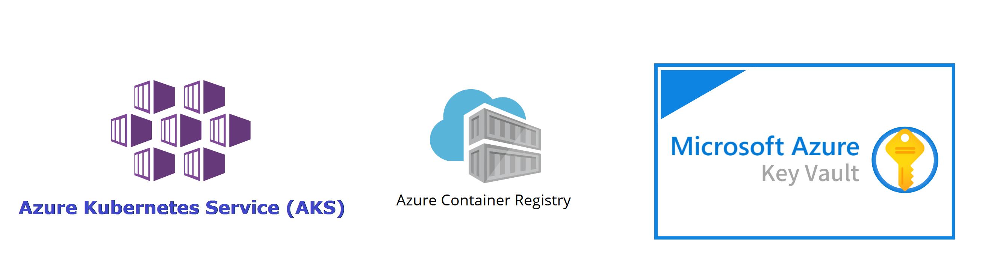

# Weight Tracker K8s Infrastructure
**This project demonstrates how to create a Kubernetes infrastructure with Terraform**

The infrastructure:
* **Managed Kubernetes Service (AKS)** - for Staging and Production environments
* **Azure Container Registry** 
* **Azure Vault**

## Configuration

1. Remote backend for Terraform state storage.
2. **Module for AKS** :
   - Create an azurerm Kubernetes cluster for each environment 
   - Attach managed identity for the AKS
   - Assign **Acrpull Role** for aks identity
   - Assign **Key Vault Secrets User** role for aks identity
3. **Module for Azure Vault** :
   - Create azurerm key vault resource
   - Add secrets to the vault

| Name | Version |
|------|---------|
|  [terraform](#requirement\_terraform) | >= 0.14 |
|  [azurerm](#requirement\_azurerm) | 3.16.0 |

## Providers

| Name | Version |
|------|---------|
|  [azurerm](#provider\_azurerm) | 3.16.0 |

## Modules

| Name | Source | Version |
|------|--------|---------|
|  [aks\_production](#module\_aks\_production) | ./modules/aks | n/a |
|  [aks\_stagting](#module\_aks\_stagting) | ./modules/aks | n/a |
|  [vault](#module\_vault) | ./modules/vault | n/a |

## Resources

| Name | Type |
|------|------|
| [azurerm_container_registry.acr](https://registry.terraform.io/providers/hashicorp/azurerm/3.16.0/docs/resources/container_registry) | resource |
| [azurerm_resource_group.rg](https://registry.terraform.io/providers/hashicorp/azurerm/3.16.0/docs/resources/resource_group) | resource |
| [azurerm_resource_group.shared_rg](https://registry.terraform.io/providers/hashicorp/azurerm/3.16.0/docs/resources/resource_group) | resource |

## Inputs

| Name | Description | Type | Default | Required |
|------|-------------|------|---------|:--------:|
|  [acr\_admin\_enabled](#input\_acr\_admin\_enabled) | allow admin | `any` | n/a | yes |
|  [acr\_sku](#input\_acr\_sku) | Select Standard or Premium SKU | `string` | `"Standard"` | no |
|  [app\_name](#input\_app\_name) | name of the webapp. | `any` | n/a | yes |
|  [node\_count](#input\_node\_count) | Number of nodes in the cluster. | `any` | n/a | yes |
|  [production\_cluster\_name](#input\_production\_cluster\_name) | production\_cluster\_name | `any` | n/a | yes |
|  [rg\_location](#input\_rg\_location) | location of the resource group. | `any` | n/a | yes |
|  [rg\_name](#input\_rg\_name) | Name of the resource group. | `any` | n/a | yes |
|  [secret\_maps](#input\_secret\_maps) | Secrets added to key vault. | `any` | n/a | yes |
|  [shared\_rg\_name](#input\_shared\_rg\_name) | Name of the resource group. | `any` | n/a | yes |
|  [staging\_cluster\_name](#input\_staging\_cluster\_name) | staging\_cluster\_name | `any` | n/a | yes |

